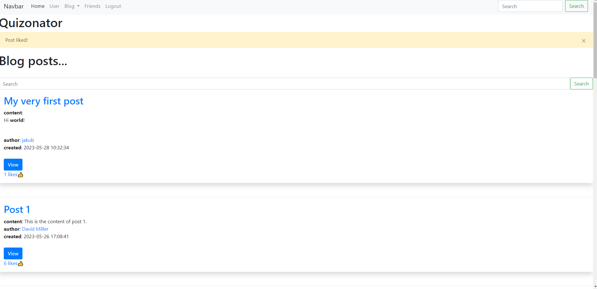

# quizoinator

## Table of contents:

- [Description](#description)
- [Technologies](#technologies)
- [Setup](#setup)
  - [Prerequisites](#prerequisites)
    - [Clone the repository](#clone-the-repository)
    - [Install python3](#install-python3)
    - [Install pip](#install-pip)
    - [Docker (optional)](#docker-optional)
  - [With python virtualenv](#with-python-virtualenv)
    - [Linux and MacOS](#linux-and-macos)
    - [Windows](#windows)
  - [With docker](#with-docker)
  - [With docker-compose](#with-docker-compose)
- [Fill the database with sample data (optional)](#fill-the-database-with-sample-data-optional)
- [Screenshots](#screenshots)
  1. [Home page](#home-page)
  2. [Sign up page](#sign-up-page)
  3. [Login page](#login-page)
  4. [User home page](#user-home-page)
  5. [Update user profile page](#update-user-profile-page)
  6. [Browse blog](#browse-blog)
  7. [Post view](#post-view)
  8. [Like view](#like-view)
  9. [Add comment](#add-comment)
  10. [Write post](#write-post)
  11. [Like post](#like-post)
  12. [Search posts](#search-posts)
  13. [Add friend](#add-friend)
  14. [Friend request](#friend-request)
  15. [Accepted friend request](#accepted-friend-request)

## Description:

Quizoinator is divided into two modules: community portal and quiz portal. The community portal is a place where users can create posts, comment on them, like them and make relationships with other users. The quiz portal is a place where users can create quizzes and solve them. The application is written in Python using the Flask framework. The database used is sqlalchemy.

## Technologies:

- Python
- Flask
- SQLAlchemy
- HTML
- CSS
- JavaScript
- Bootstrap
- Docker
- Docker-compose

## Setup

After successful setup, the application will be available at http://localhost:5000

### Prerequisites:

#### Clone the repository

```bash
git clone https://github.com/KubiakJakub01/quizoinator.git 
cd quizoinator
```

#### Install python3:

* Linux:
```bash
sudo apt install python3
```

* Windows: https://www.python.org/downloads/windows/

* MacOS:
https://www.python.org/downloads/mac-osx/

For MacOS you can also use Homebrew:
```bash
brew install python3
```

For more information visit:
```bash
https://docs.python-guide.org/starting/install3/osx/
```

After installing python, make sure that it is added to the PATH.
Check it by running the following command:
```bash
python3 --version
```

#### Install pip

Follow the instructions on: https://pip.pypa.io/en/stable/installation/ to install pip.

#### Docker (optional)

Follow the instructions on: https://docs.docker.com/get-docker/ to install docker.

### With python virtualenv

Create a virtual environment and install the requirements:

#### Linux and MacOS

```bash
python3 -m venv .venv
source venv/bin/activate
pip install -r requirements.txt
```

#### Windows

```bash
python -m venv .venv
.\venv\Scripts\activate
pip install -r requirements.txt
```

Then run the application:

```bash
python3 app.py
```

### With docker

Build the image:

```bash
docker build -t quizoinator .
```

Run the container:

```bash
docker run -p 5000:5000 -v ./instance:/app/instance -v ./src/static/user/images:/app/src/static/user/images quizoinator
```

### With docker-compose

```bash
docker compose up
```

## Fill the database with sample data (optional)

To fill the database with sample data, run the following script:

```python3
python3 feed_db_with_sample_data.py \
        [--db_url instance/database.db] \
        [--pictures_dir images/sample_avatars] \
        [--pictures_save_dir src/static/user/images] \
        [--posts_num 10] \
        [--comments_num 30] \
        [--likes_num 50] \
        [--relationships_num 20]
```

## Screenshots

1. Home page:


2. Sign up page:

Click on the ```Sign up``` button in the navbar.


3. Login page:

Click on the ```Login``` button in the navbar.


4. User home page:

After successful login, you will be redirected to the user home page.


5. Update user profile page:

Click on the ```Update``` button in the navbar.


6. Browse blog:

Click on the ```Blog``` button in the navbar to browse the blog.


Click on the ```View posts``` button to view blog.


7. Post view:

Click on the ```View``` or in the post title to view post.


8. Like view:

Click on the likes text to view who liked the post.


9. Add comment:

Write a comment and click on the ```Add``` button.


Your comment will be added to the post.


10. Write post:

To write a post, click on the ```Blog -> Add post``` button in the navbar.


Write title, content and click on the ```Add``` button.


After adding the post, you will be redirected to the blog.


11. Like post:

To like a post, click on the ```Like``` button.



12. Search posts:

You can search posts by title or content.


13. Add friend:

To search for users write their username in the search bar.


Then click on the ```Search``` button. If the user exists, you will be redirected to his profile.


You can send a friend request by clicking on the ```Add friend``` button.


You can view your friends by clicking on the ```Friends``` button in the navbar.


14. Friend request:

If someone sends you a friend request in Friends view you will see a notification.
You can accept or reject the friend request.


15. Accepted friend request:


